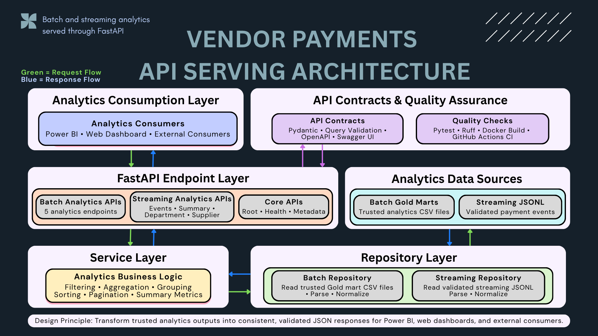

# Vendor Payments API Serving

FastAPI serving layer for trusted Vendor Payments batch and streaming analytics data.

This project is part of the Vendor Payments Data Engineering Portfolio.

## Architecture



```text
Analytics Consumers
        ↓ Request
FastAPI Endpoint Layer
        ↓
Service Layer
        ↓
Repository Layer
        ↓
Analytics Data Sources

Analytics Data Sources
        ↑ Returned Data
Repository Layer
        ↑
Service Layer
        ↑
FastAPI Endpoint Layer
        ↑ JSON Response
Analytics Consumers
```

API contracts are enforced at the FastAPI boundary through Pydantic models, query validation, and OpenAPI documentation. Project-wide quality checks are provided by Pytest, Ruff, Docker builds, and GitHub Actions CI.

## Current Features

- FastAPI application
- Root, health, and metadata endpoints
- Batch analytics endpoints backed by trusted Gold marts
- Streaming event and analytics summary endpoints
- Pydantic request and response validation
- Fiscal year and text-based filtering
- Limit and offset pagination
- Swagger/OpenAPI documentation
- Docker container support
- Pytest automated tests
- Ruff linting
- GitHub Actions CI

## API Endpoints

### Core APIs

#### Root

```http
GET /
```

#### Health

```http
GET /health
```

#### Metadata

```http
GET /api/v1/metadata
```

## Batch Analytics

### Spending by Fiscal Year

```http
GET /api/v1/batch/spending-by-fiscal-year
```

Returns trusted spending metrics aggregated by fiscal year.

### Spending by Department

```http
GET /api/v1/batch/spending-by-department
```

Supported query parameters:

- `fiscal_year`
- `department`
- `limit`
- `offset`

Example:

```http
GET /api/v1/batch/spending-by-department?fiscal_year=2007&limit=5
```

### Top Suppliers

```http
GET /api/v1/batch/top-suppliers
```

Supported query parameters:

- `supplier_name`
- `limit`
- `offset`

Example:

```http
GET /api/v1/batch/top-suppliers?supplier_name=BANK&limit=10
```

### Pending by Department

```http
GET /api/v1/batch/pending-by-department
```

Supported query parameters:

- `fiscal_year`
- `department`
- `limit`
- `offset`

Example:

```http
GET /api/v1/batch/pending-by-department?department=Public%20Health&limit=5
```

### Fund Category Summary

```http
GET /api/v1/batch/fund-category-summary
```

Supported query parameters:

- `fiscal_year`
- `fund_type`
- `fund_category`
- `limit`
- `offset`

Example:

```http
GET /api/v1/batch/fund-category-summary?fund_type=General%20Fund&fund_category=Operating&limit=5
```

## Streaming Analytics

### Streaming Events

```http
GET /api/v1/streaming/events
```

Returns paginated vendor payment events from the validated streaming sample dataset.

Supported query parameters:

- `fiscal_year`
- `department`
- `supplier_name`
- `dedup_status`
- `limit`
- `offset`

Example:

```http
GET /api/v1/streaming/events?fiscal_year=2021&supplier_name=ERIE&limit=5
```

### Streaming Summary

```http
GET /api/v1/streaming/summary
```

Returns dashboard-ready streaming metrics, including:

- Total event count
- Total payment amount
- Unique department count
- Unique supplier count
- Minimum and maximum fiscal year
- Event counts grouped by fiscal year
- Event counts grouped by deduplication status

### Department Summary

```http
GET /api/v1/streaming/department-summary
```

Returns department-level streaming metrics.

Supported query parameters:

- `fiscal_year`
- `department`
- `limit`
- `offset`

Example:

```http
GET /api/v1/streaming/department-summary?fiscal_year=2021&limit=5
```

### Supplier Summary

```http
GET /api/v1/streaming/supplier-summary
```

Returns supplier-level streaming metrics.

Supported query parameters:

- `fiscal_year`
- `supplier_name`
- `limit`
- `offset`

Example:

```http
GET /api/v1/streaming/supplier-summary?supplier_name=MEDLINE%20INDUSTRIES%20INC&limit=5
```

## Project Structure

```text
vendor-payments-api-serving/
│
├── app/
│   ├── main.py
│   ├── config.py
│   │
│   ├── api/
│   │   ├── health.py
│   │   ├── metadata.py
│   │   ├── batch.py
│   │   └── streaming.py
│   │
│   ├── models/
│   │   ├── common.py
│   │   ├── batch.py
│   │   └── streaming.py
│   │
│   ├── repositories/
│   │   ├── batch_repository.py
│   │   └── streaming_repository.py
│   │
│   └── services/
│       ├── batch_service.py
│       └── streaming_service.py
│
├── assets/
│   └── vendor-payments-api/
│       ├── batch/
│       └── streaming/
│
├── data/
│   ├── batch/
│   │   ├── mart_spending_by_fiscal_year.csv
│   │   ├── mart_spending_by_department.csv
│   │   ├── mart_spending_by_supplier_top_n.csv
│   │   ├── mart_pending_by_department.csv
│   │   └── mart_fund_category_summary.csv
│   │
│   └── streaming/
│       └── vendor_payments_streaming_sample.jsonl
│
├── tests/
│   ├── test_health.py
│   ├── test_metadata.py
│   ├── test_batch_endpoints.py
│   └── test_streaming_endpoints.py
│
├── Dockerfile
├── docker-compose.yml
├── requirements.txt
└── README.md
```

## Run Locally

Create and activate the virtual environment:

```powershell
python -m venv .venv
.\.venv\Scripts\Activate.ps1
```

Install dependencies:

```powershell
python -m pip install --upgrade pip
python -m pip install -r requirements.txt
```

Run the API:

```powershell
python -m uvicorn app.main:app --reload
```

Open Swagger documentation:

```text
http://127.0.0.1:8000/docs
```

Open the health endpoint:

```text
http://127.0.0.1:8000/health
```

## Run with Docker

Build and start the API container:

```powershell
docker compose up --build
```

Open Swagger documentation:

```text
http://localhost:8000/docs
```

Open the health endpoint:

```text
http://localhost:8000/health
```

Stop the container:

```powershell
docker compose down
```

## Validation

Run the automated test suite:

```powershell
python -m pytest -v
```

Run Ruff:

```powershell
python -m ruff check app tests
```

Build the Docker image:

```powershell
docker build -t vendor-payments-api-serving:test .
```

Current validation covers:

- Root, health, and metadata endpoints
- Batch analytics endpoints
- Streaming events and summary endpoints
- Fiscal year and text filters
- Combined filters
- Limit and offset pagination
- Invalid pagination responses
- Expected JSON response structures

## Continuous Integration

GitHub Actions validates the project by running:

```text
Ruff
→ Pytest
→ Docker image build
```

## Planned Development

- Power BI integration
- Browser-based web dashboard
- Cloud-backed data source integration
- Production deployment
- API authentication and authorization
- Logging, monitoring, and observability
- Cache and warehouse-backed serving improvements

## Portfolio Integration

This API acts as the serving layer for the wider Vendor Payments Data Engineering Portfolio:

```text
Project 1 — Batch ETL Pipeline
Project 2 — API and Serving Layer
Project 3 — Kafka Streaming Pipeline
Project 4 — Airflow Orchestration
Project 5 — Cloud Data Platform
```

The goal is to expose trusted analytics-ready data to Power BI, web dashboards, and other external consumers without requiring them to read local files or cloud storage objects directly.
