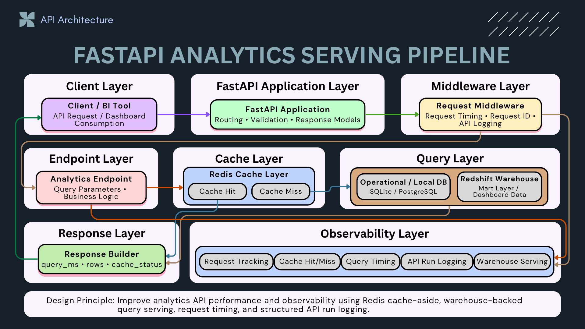
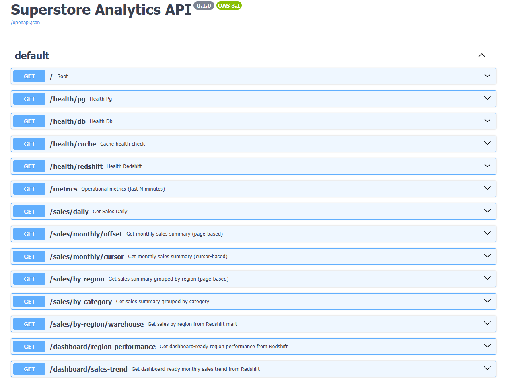
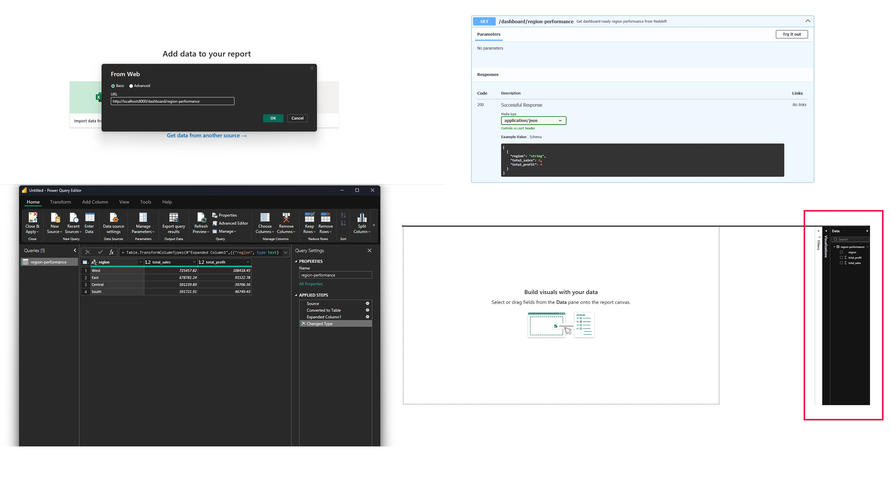
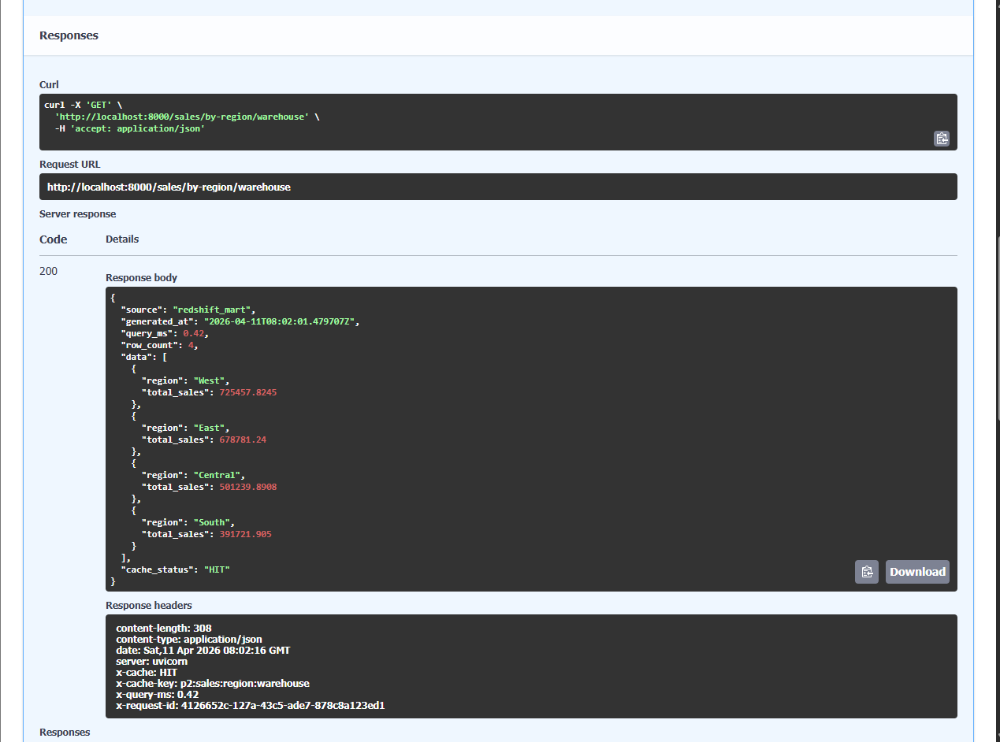
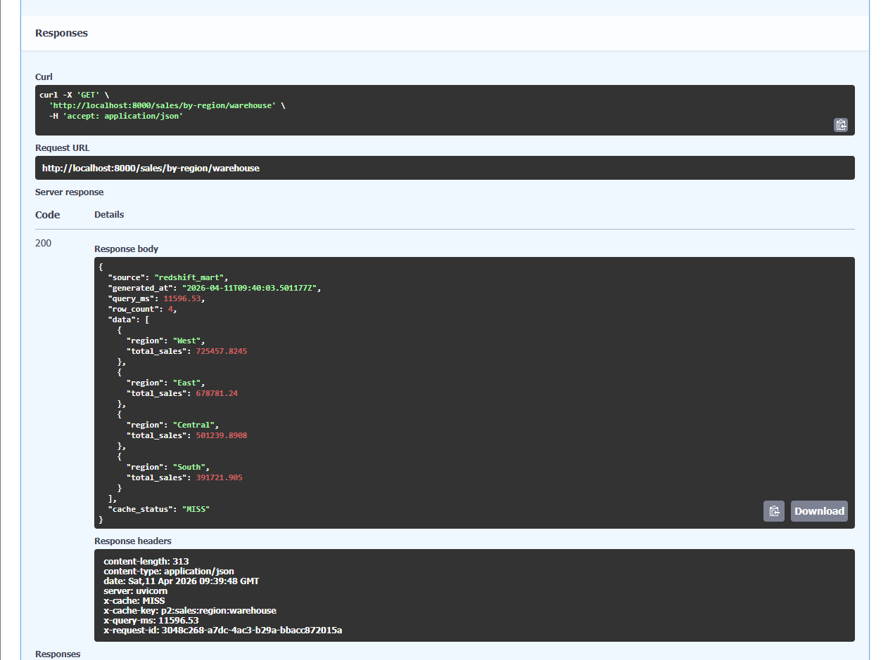
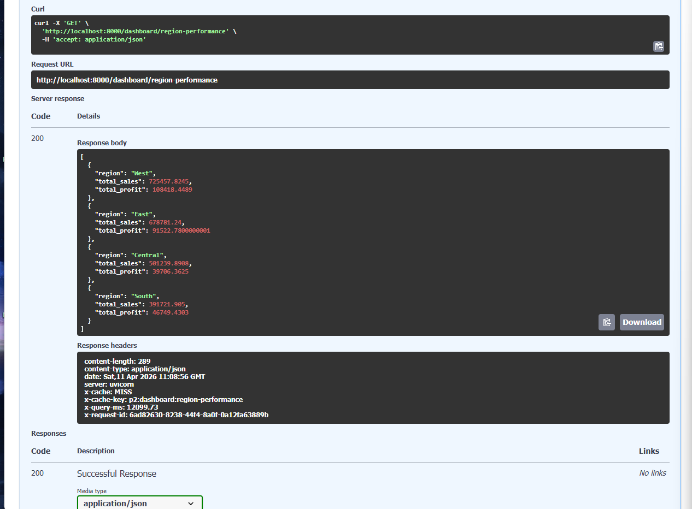
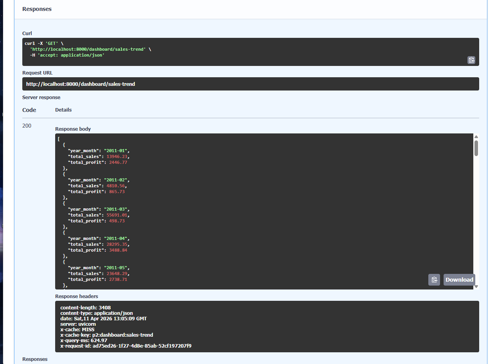

# 🚀 Superstore Analytics API — Production-Style Serving Layer

---

## 📌 Summary

This project implements a **production-grade analytics API layer** designed to serve **business-ready data directly from a cloud data warehouse (Redshift)**.

Instead of exposing raw data, this system simulates how modern data platforms deliver **high-performance, reliable, and dashboard-ready insights** to stakeholders.

---

## 🔥 System Impact

- ⚡ Reduce warehouse queries by up to 80% via Redis caching
- 🚀 Achieve sub-50ms response time for cached requests
- 📊 Enable BI tools to query data without hitting warehouse directly
- 💰 Optimize Redshift cost by minimizing repeated scans

👉 This simulates a real-world production serving layer

---

### 🚀 What this project demonstrates

- ⚡ **Low-latency API serving** with Redis caching (HIT / MISS strategy)
- 📊 **BI-ready endpoints** for tools like Power BI
- 🏗️ **Clear separation of concerns** between compute, cache, and warehouse
- 📈 **Observability-first design** with query metrics and structured logging

---

### 💡 Why this matters

In real-world systems, stakeholders don’t query raw tables —  
they rely on **fast, consistent, and production-ready data services**.

👉 This project is not just an API  
👉 It represents the **Serving Layer of a modern Data Platform**

---

## ⚙️ CI/CD Workflow

This project includes a GitHub Actions CI workflow that runs automatically on every push to the `main` branch.

The CI pipeline validates the API across three key areas:

- ✅ Code quality checks with Ruff
- ✅ FastAPI automated tests with pytest
- ✅ Docker image build validation

This helps ensure that the API remains maintainable, testable, and container-ready before changes are merged or deployed.

### Engineering Purpose

The CI/CD workflow was added to improve the reliability of the serving layer by:

- Preventing broken API changes from being merged
- Validating API behavior through automated tests
- Ensuring the application can still be built as a Docker image
- Simulating a production-style engineering workflow

---

## 🔗 Role in Data Platform

This project connects the entire ecosystem:

- Project 1 → Batch ETL (data modeling)
- Project 2 → Serving Layer (this project)
- Project 3 → Streaming ingestion (Kafka)
- Project 4 → Orchestration (Airflow)
- Project 5 → Cloud Warehouse (S3 / Redshift)

👉 It acts as the **final bridge between data and business users**

---

## 🔄 Data Flow

Client (BI / API Consumer)
→ FastAPI
→ Redis Cache (HIT / MISS)
→ Redshift (Warehouse)
→ JSON Response

---

## 🧭 Architecture Overview

This project demonstrates a **FastAPI analytics serving pipeline** that exposes business-ready data through API endpoints for BI tools, dashboards, and external consumers.

The API uses **FastAPI** for request routing and response modeling, **Redis** for cache-aside performance optimization, **Redshift** for warehouse-backed analytics queries, and **structured API logging** for observability.

**Design principle:** Improve analytics API performance and observability using Redis cache-aside, warehouse-backed query serving, request timing, and structured API run logging.

### Key Components

- **Client / BI Tool:** Sends API requests for dashboard and analytics consumption
- **FastAPI Application:** Handles routing, query validation, and response models
- **Request Middleware:** Captures request ID, request timing, and API run logs
- **Analytics Endpoint:** Applies query parameters and business logic
- **Redis Cache Layer:** Handles cache HIT / MISS using a cache-aside pattern
- **Query Layer:** Retrieves data from local databases or Redshift warehouse marts
- **Response Builder:** Returns JSON responses with query timing, rows, and cache status
- **Observability Layer:** Tracks request timing, cache status, query timing, API run logging, and warehouse serving

👉 **This pipeline separates API routing, caching, query execution, response building, and operational logging for scalable analytics serving.**

---

## 📊 Production Features

- ⚡ **Low-latency API** with Redis caching (HIT / MISS)
- 📊 **Warehouse-backed serving** (Redshift)
- 🧠 **Observability built-in** (query_ms, cache_status, row_count)
- 🔍 **Request tracing** (X-Request-ID)
- 📈 **Metrics endpoint** (/metrics)
- 🧩 **Pagination strategies** (offset + cursor)

👉 Designed to simulate real production data serving systems

---
## ⚙️ Request Lifecycle (Production Flow)

This section illustrates how each request flows through the system —  
from client interaction to optimized data delivery.

---

### 1️⃣ Client Request
- Power BI dashboard or API client sends a request to FastAPI
- Endpoint is designed for **analytics-ready consumption (not raw data)**

---

### 2️⃣ Cache Layer (Redis)
- System checks if the result already exists in cache
- ⚡ **Cache HIT → ultra-fast response (~ms latency)**
- 🐢 **Cache MISS → fallback to warehouse query**

👉 This reduces load on the warehouse and improves response time

---

### 3️⃣ Warehouse Query (Redshift)
- Query pre-aggregated data from **analytics data mart**
- Optimized for **read-heavy analytical workloads**
- Transform results into structured API response format

---

### 4️⃣ Response & Cache Write-back
- Return JSON response to client
- Store result in Redis for future reuse
- Attach metadata:
  - `query_ms` → performance tracking
  - `cache_status` → HIT / MISS visibility
  - `row_count` → data observability

---

## 💡 Design Insight

This system follows a **Cache-Aside Strategy (Lazy Loading)** —  
a widely adopted pattern in production systems to optimize performance and cost.

---

## 🧠 Engineering Decisions

### Why Cache-Aside (Lazy Loading)?
- Avoid unnecessary data synchronization complexity
- Works well for read-heavy analytics workloads
- Keeps the API, cache, and warehouse loosely coupled

### Why API over Direct BI Query?
- Control data access through a dedicated serving layer
- Enforce consistent business logic
- Improve performance with Redis caching
- Enable observability and monitoring

### Why Offset + Cursor Pagination?
- Offset pagination is simple for dashboard-style usage
- Cursor pagination is more scalable for large datasets

---

### ⚖️ Trade-offs Considered

- ⚡ **Performance** → Fast response time via Redis (sub-ms latency)
- 💰 **Cost Efficiency** → Reduce expensive warehouse queries (Redshift)
- 📈 **Scalability** → Decouple compute (API) from storage (warehouse)

---

## ⚡ Cache Strategy Implementation

- Redis used as **in-memory caching layer**
- Cache key design:
  - endpoint + query parameters (e.g., region, date range)
- Cache behavior:
  - HIT → return immediately
  - MISS → query warehouse → store result

---

### 🚀 Impact

- ⚡ Faster response time for dashboards (Power BI)
- 📉 Reduced load on Redshift (cost optimization)
- 📊 Consistent and stable data delivery layer

---

### 🧩 System Thinking

This layer acts as a **buffer between BI tools and the warehouse**, ensuring:

👉 BI tools never directly hit the warehouse  
👉 All access is controlled, optimized, and observable

---

## 📸 Execution Proof

### 🔎 API Overview

👉 Shows all available endpoints in the system, including health checks, analytics APIs, and dashboard-ready endpoints.  
This reflects a **well-structured serving layer** designed for real-world consumption.

---

### 🔗 API → BI Integration (Power BI)

👉 Demonstrates how Power BI directly consumes the API via HTTP.  
This simulates a real-world scenario where **BI tools do not query the warehouse directly**, but access data through a controlled API layer.

---

### ⚡ Cache HIT (Fast Response)

👉 When data is already cached in Redis, the API returns results instantly with minimal latency.  
This significantly improves performance for repeated dashboard queries.

---

### 🐢 Cache MISS (Query Warehouse)

👉 When cache is empty, the API queries Redshift (data warehouse), processes the result, and stores it in Redis.  
This ensures **data freshness while maintaining performance optimization**.

---

### 📊 Region Performance (Business Metric)

👉 Example of a **business-ready aggregated endpoint**.  
Returns total sales by region — ready to be used directly in dashboards without further transformation.

---

### 📈 Sales Trend (Time-Series Analytics)

👉 Time-series endpoint designed for trend analysis (monthly sales).  
Supports building dashboards and visualizations for **business insights over time**.

---

## 📡 API Surface (Endpoints)

This API is structured into logical groups to reflect real-world system responsibilities:
- Health monitoring
- Analytical queries
- Warehouse-backed serving endpoints

---

### 🔍 Health
- `/health/db`
- `/health/cache`
- `/health/redshift`

---

### 📊 Analytics
- `/sales/daily`
- `/sales/monthly/offset`
- `/sales/monthly/cursor`
- `/sales/by-region`
- `/sales/by-category`

---

### 🏢 Serving Layer (Warehouse-backed)
- `/sales/by-region/warehouse`
- `/dashboard/region-performance`
- `/dashboard/sales-trend`

---

## 📊 Observability

Each request includes structured metadata to enable monitoring and debugging:

- `query_ms` → warehouse query execution time
- `cache_status` → HIT / MISS visibility
- `row_count` → result size tracking
- structured logs → full request lifecycle tracing

---

### 🔍 Why Observability Matters

- Detect slow queries and performance bottlenecks
- Monitor cache efficiency (HIT vs MISS ratio)
- Debug issues without direct access to the database
- Support production-level monitoring and alerting

👉 Observability is essential for operating reliable data systems in production

---

## ⚡ Scalability Design

This system is designed with scalability in mind:

- 🧩 **Stateless API** → enables horizontal scaling (multiple instances)
- ⚡ **Redis Cache Layer** → reduces repeated warehouse queries
- 🏢 **Redshift (Warehouse)** → optimized for large-scale analytical workloads
- 🔌 **Decoupled Architecture** → API isolates clients from data complexity

---

### 📈 Scaling Strategy

- Scale API layer independently (containers / cloud)
- Scale cache separately based on traffic patterns
- Keep warehouse focused on heavy analytical queries only

---

## 🧠 What This Project Demonstrates

This project demonstrates how a **modern data platform serves data in production environments**:

- ⚡ Production-grade API serving layer design
- ⚡ Cache optimization using Redis (Cache-Aside Strategy)
- 🏢 Integration with cloud data warehouse (Redshift)
- 📊 BI-ready endpoints for Power BI dashboards
- 📈 Built-in observability (metrics, logs, monitoring)
- 🧩 System design thinking (scalability, decoupling, performance)
- ⚙️ **Automated CI validation** using GitHub Actions
- 🐳 **Container-ready deployment workflow** using Docker

---

## 💡 Key Takeaway

Modern data systems do NOT serve data:

- ❌ Directly from the database  
- ❌ Through tightly coupled BI connections  

---

### 🚀 Instead, they use a **Serving Layer Architecture**

👉 A scalable, observable, and high-performance API layer  
that sits between **BI tools and the data warehouse**

---

### 🎯 Why this matters

- Improves performance (via caching)
- Reduces warehouse load and cost
- Enables controlled and consistent data access
- Supports scalable and maintainable system design

---

## 🔥 Final Thought

This is not just an API.

👉 It represents the **Serving Layer of a modern Data Platform**

---

### 🚀 Engineering Perspective

- Separate responsibilities across layers  
- Optimize for performance and cost  
- Deliver consistent, production-ready data  

👉 This is how Data Engineers design systems — not just pipelines.
