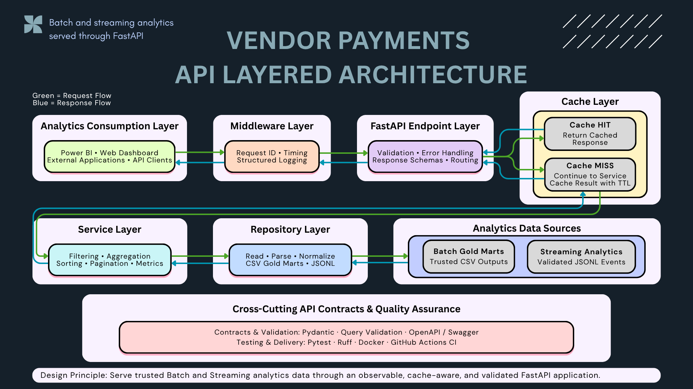
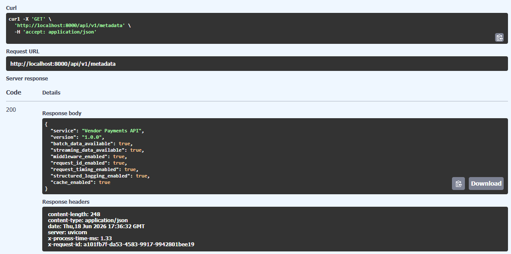
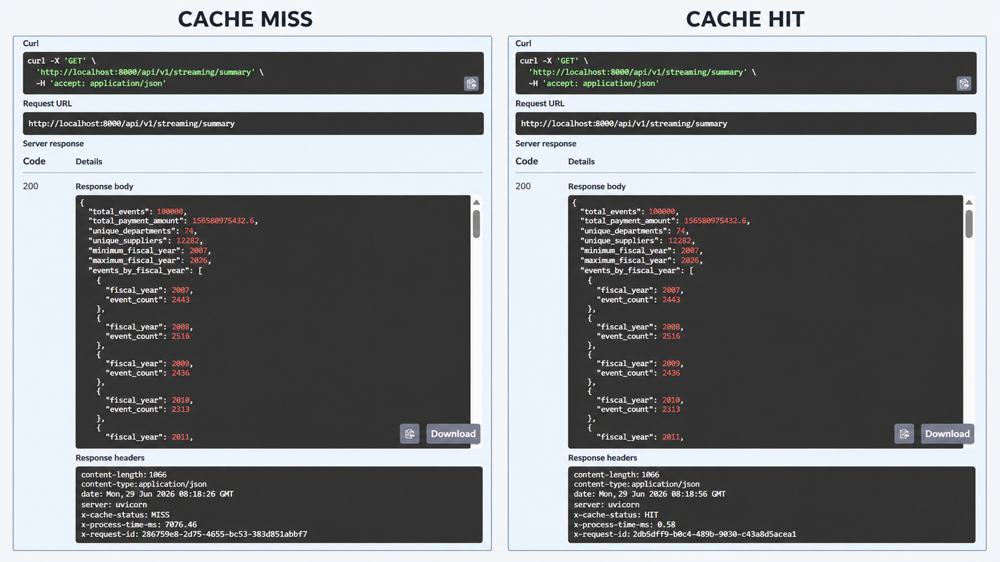
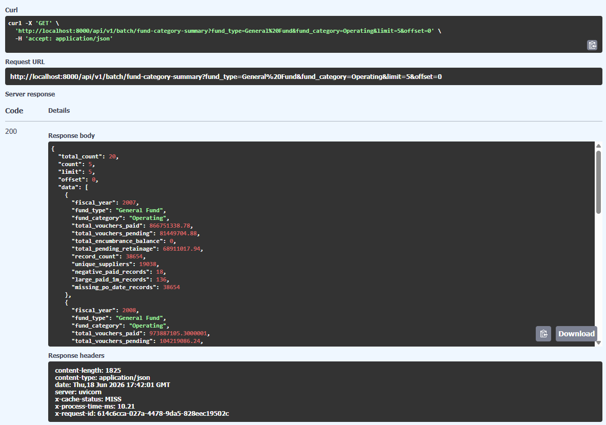
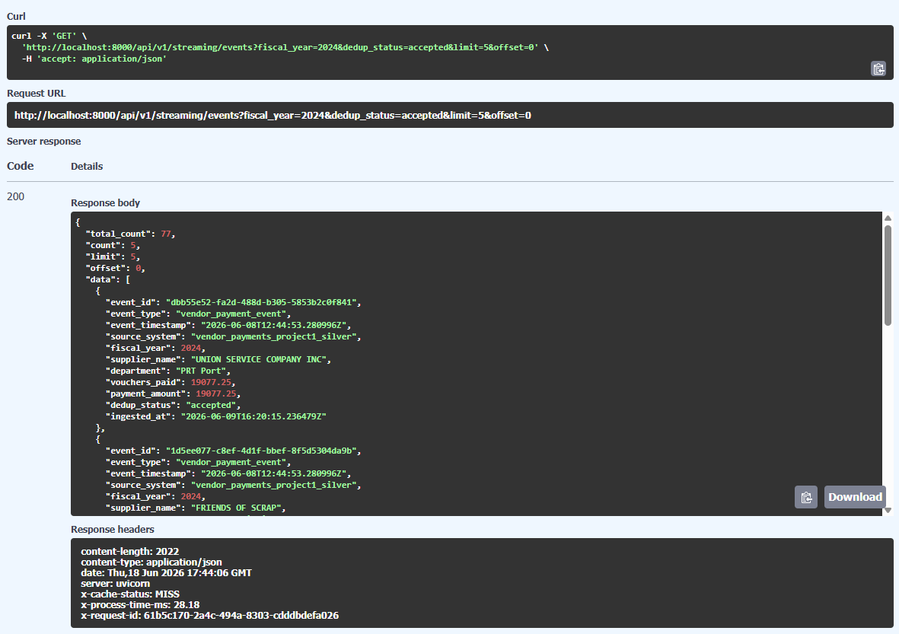
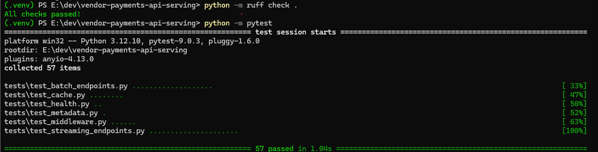
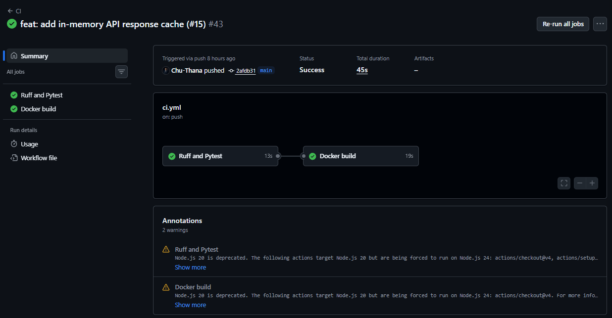

# 🚀 Vendor Payments API Serving


FastAPI serving layer for trusted Vendor Payments batch and streaming analytics data.

This project is part of the **Vendor Payments Data Engineering Portfolio** and acts as the API bridge between analytics-ready outputs and downstream consumers such as Power BI, web dashboards, and external applications.

---

## 📌 Project Summary

The application exposes processed Batch and Streaming data through validated REST endpoints instead of requiring consumers to read CSV or JSONL files directly.

It demonstrates:

- Layered API architecture
- Batch and Streaming analytics endpoints
- Pydantic request and response contracts
- Request observability middleware
- In-memory cache-aside behavior
- Query-aware cache keys and TTL expiration
- Automated testing, linting, Docker validation, and GitHub Actions CI

---

## 🧭 Architecture



The request lifecycle follows this path:

```text
Analytics Consumer
→ Middleware
→ FastAPI Endpoint
→ Cache Lookup

Cache HIT
→ Return cached response

Cache MISS
→ Service
→ Repository
→ Analytics Data Source
→ Store successful result in cache
→ Return validated JSON response
```

### Layer Responsibilities

- **Analytics Consumption Layer** — Power BI, web dashboards, external applications, and API clients
- **Middleware Layer** — Request ID, timing, structured request logs, and structured error logs
- **FastAPI Endpoint Layer** — Routing, query validation, response schemas, and error handling
- **Cache Layer** — Cache HIT/MISS, query-aware keys, and TTL-based expiration
- **Service Layer** — Filtering, aggregation, sorting, pagination, and summary metrics
- **Repository Layer** — CSV and JSONL access, parsing, and value normalization
- **Analytics Data Sources** — Trusted Batch Gold marts and validated Streaming events
- **API Contracts & Quality Assurance** — Pydantic, OpenAPI, Pytest, Ruff, Docker, and GitHub Actions

---

## ✨ Current Features

### Core APIs

```http
GET /
GET /health
GET /api/v1/metadata
```

### Batch Analytics APIs

```http
GET /api/v1/batch/spending-by-fiscal-year
GET /api/v1/batch/spending-by-department
GET /api/v1/batch/top-suppliers
GET /api/v1/batch/pending-by-department
GET /api/v1/batch/fund-category-summary
```

### Streaming Analytics APIs

```http
GET /api/v1/streaming/events
GET /api/v1/streaming/summary
GET /api/v1/streaming/department-summary
GET /api/v1/streaming/supplier-summary
```

Supported capabilities include:

- Fiscal year filtering
- Department and supplier filtering
- Fund type and fund category filtering
- Deduplication status filtering
- Combined query filters
- Limit and offset pagination
- Pydantic response models
- Swagger/OpenAPI documentation

---

## 🔎 Runtime Capabilities

The metadata endpoint reports the capabilities currently enabled by the API.

```json
{
  "service": "Vendor Payments API",
  "version": "1.0.0",
  "batch_data_available": true,
  "streaming_data_available": true,
  "middleware_enabled": true,
  "request_id_enabled": true,
  "request_timing_enabled": true,
  "structured_logging_enabled": true,
  "cache_enabled": true
}
```



---

## 🧠 Middleware Observability

Every request passes through the observability middleware before reaching the endpoint layer.

The middleware provides:

- Unique request ID generation
- Preservation of client-provided request IDs
- Processing-time measurement
- Structured completion logs
- Structured unhandled-error logs

Successful responses include:

```text
X-Request-ID
X-Process-Time-MS
```

Example:

```text
X-Request-ID: c31a25fa-e360-411d-9415-c6588feb3d7c
X-Process-Time-MS: 0.51
```

---

## ⚡ API Response Cache

The API uses an **in-memory cache-aside strategy** for Batch and Streaming analytics endpoints.

### Cache Behavior

- Cache backend: In-memory Python cache
- Default TTL: 60 seconds
- Cache key: Endpoint namespace plus normalized query parameters
- Cache HIT: Return the cached response
- Cache MISS: Call the service, store the successful result, and return the response
- Invalid requests: Not cached
- Server errors: Not cached

Cached endpoints include:

```text
X-Cache-Status: MISS
```

or:

```text
X-Cache-Status: HIT
```



### Cache Performance Benchmark

A repeated request to the Streaming Summary endpoint demonstrates the impact of the cache-aside strategy:

```text
Endpoint: GET /api/v1/streaming/summary
Records summarized: 100,000 streaming events

Cache MISS: 7,076.46 ms
Cache HIT: 0.58 ms
Latency reduction: 99.99%
Cached response: approximately 12,200× faster
```

The first request reads and aggregates the streaming dataset before storing the validated response in the in-memory cache. An identical request made within the configured TTL is served directly from the cache.

The current cache is process-local and is cleared when the API restarts. Redis-backed shared caching remains a planned production improvement.

---

## 📊 Batch Analytics Evidence

The Batch APIs serve trusted Gold mart outputs generated by the Vendor Payments ETL pipeline.

Example: filtered fund category summary for `General Fund` and `Operating`.



---

## 🌊 Streaming Analytics Evidence

The Streaming APIs expose validated event-level data and dashboard-ready summaries.

Example: accepted streaming payment events filtered by fiscal year.



---

## ✅ Validation

The project is validated locally with Ruff and Pytest.

```powershell
python -m ruff check .
python -m pytest
```

Current result:

```text
Ruff passed
57 tests passed
```



Validation covers:

- Root, health, and metadata endpoints
- Batch and Streaming API responses
- Filters and combined filters
- Pagination and invalid pagination requests
- Request ID and timing headers
- Structured request and error logging
- In-memory cache storage and retrieval
- TTL expiration
- Stable normalized cache keys
- Cache MISS followed by HIT
- Separate cache entries for different query parameters
- Invalid requests not being cached

---

## ⚙️ Continuous Integration

GitHub Actions runs automatically on changes to the repository.

```text
Ruff and Pytest
→ Docker image build
```



The CI workflow acts as a quality gate by checking code quality, API behavior, and container build readiness.

---

## 🗂️ Project Structure

```text
vendor-payments-api-serving/
│
├── app/
│   ├── api/
│   │   ├── batch.py
│   │   ├── health.py
│   │   ├── metadata.py
│   │   └── streaming.py
│   │
│   ├── cache/
│   │   ├── in_memory.py
│   │   └── keys.py
│   │
│   ├── middleware/
│   │   └── observability.py
│   │
│   ├── models/
│   ├── repositories/
│   ├── services/
│   ├── config.py
│   └── main.py
│
├── assets/
│   └── vendor-payments-api/
│       ├── architecture/
│       ├── batch/
│       ├── evidence/
│       └── streaming/
│
├── data/
│   ├── batch/
│   └── streaming/
│
├── tests/
│   ├── test_batch_endpoints.py
│   ├── test_cache.py
│   ├── test_health.py
│   ├── test_metadata.py
│   ├── test_middleware.py
│   └── test_streaming_endpoints.py
│
├── Dockerfile
├── docker-compose.yml
├── requirements.txt
└── README.md
```

---

## ▶️ Run Locally

Create and activate a virtual environment:

```powershell
python -m venv .venv
.\.venv\Scripts\Activate.ps1
```

Install dependencies:

```powershell
python -m pip install --upgrade pip
python -m pip install -r requirements.txt
```

Run the API:

```powershell
python -m uvicorn app.main:app --reload
```

Open Swagger documentation:

```text
http://127.0.0.1:8000/docs
```

---

## 🐳 Run with Docker

Build and start the API:

```powershell
docker compose up --build
```

Open Swagger:

```text
http://localhost:8000/docs
```

Stop the containers:

```powershell
docker compose down
```

---

## 🔗 Role in the Vendor Payments Data Platform

```text
Project 1 — Batch ETL Pipeline
Project 2 — API Serving Layer
Project 3 — Kafka Streaming Pipeline
Project 4 — Airflow Orchestration
Project 5 — Cloud Data Platform
```

Project 2 transforms trusted Batch and Streaming analytics outputs into consistent, validated, observable, and cache-aware JSON responses for downstream consumers.

---

## 🛣️ Planned Development

- Redis-backed shared cache
- Cache invalidation and administration controls
- Power BI integration
- Browser-based web dashboard
- Cloud-backed data source integration
- Authentication and authorization
- Rate limiting
- Production deployment
- Centralized monitoring and observability

---

## 🎯 Key Takeaway

This project is not only a collection of API endpoints.

It demonstrates how a layered analytics serving application can expose trusted data through validated contracts, request observability, cache-aware response handling, automated quality checks, and consumer-ready interfaces.
